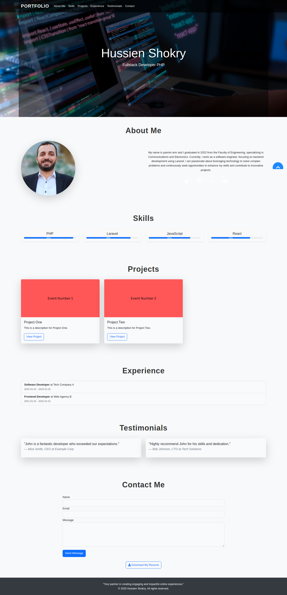
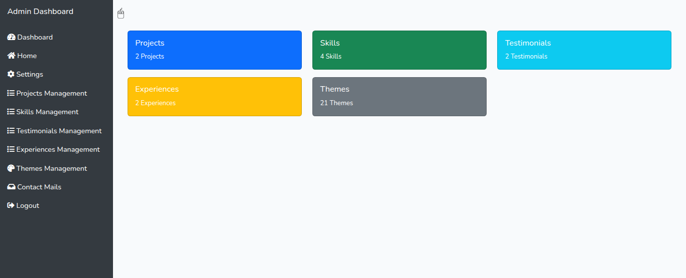
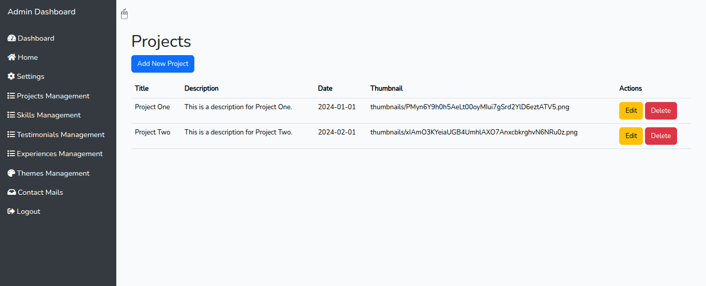
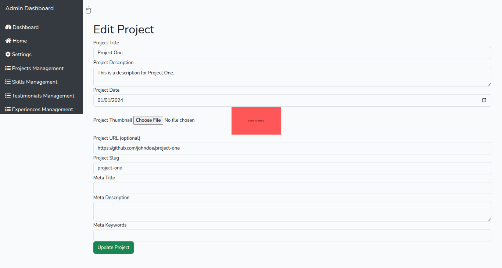
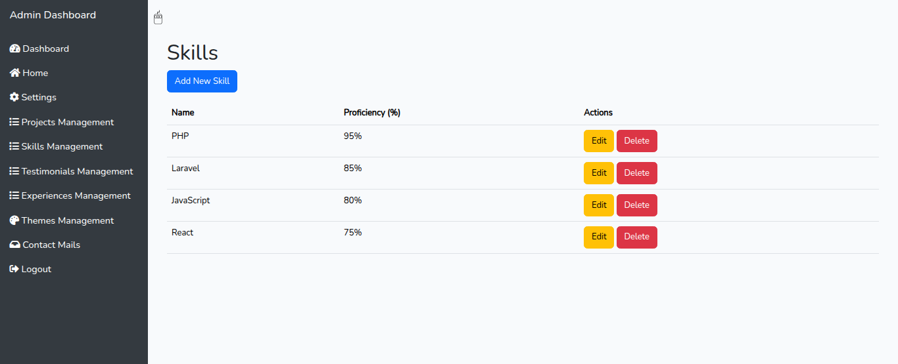
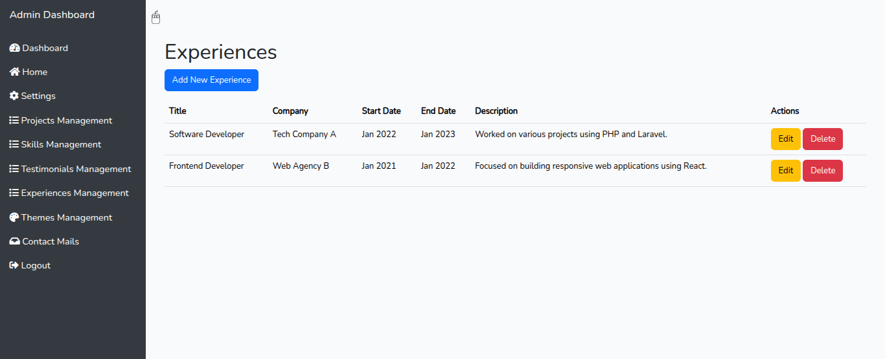
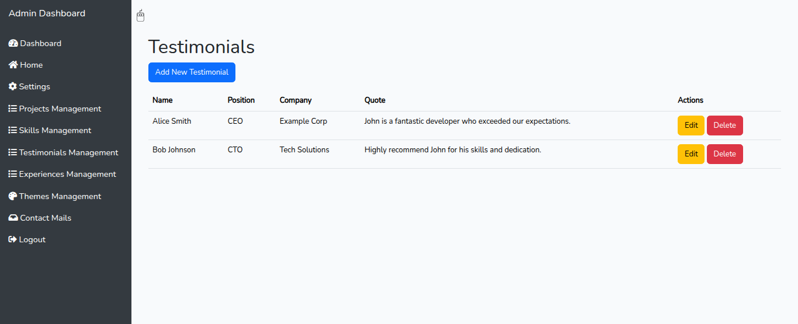
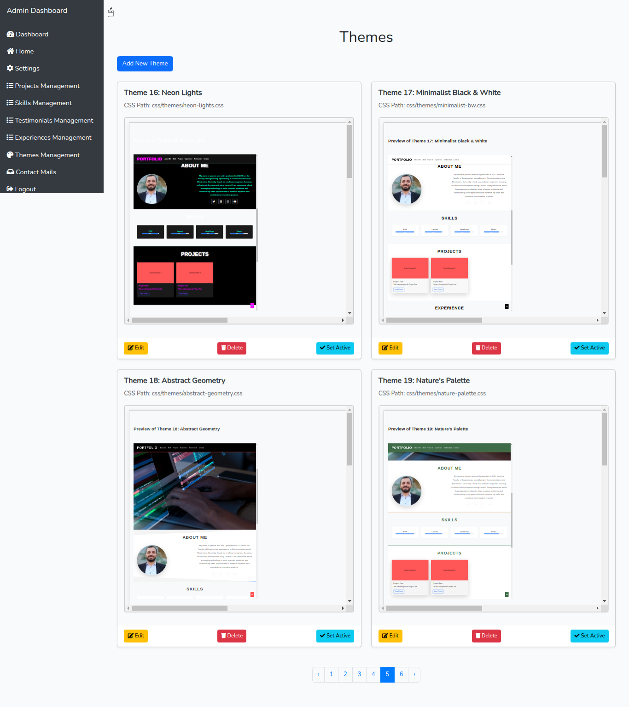
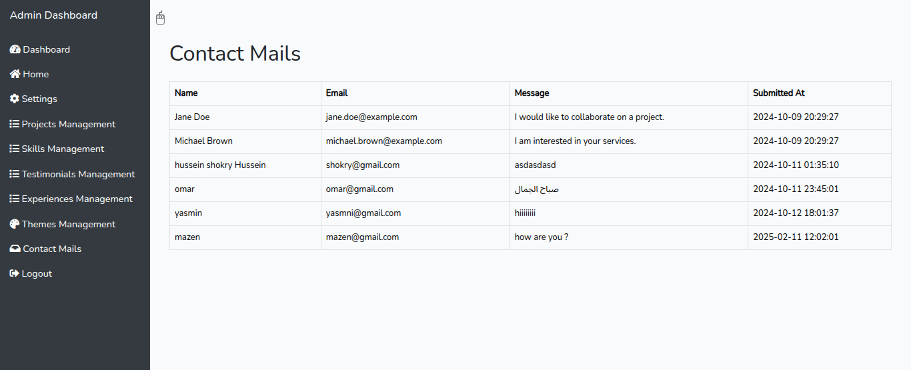
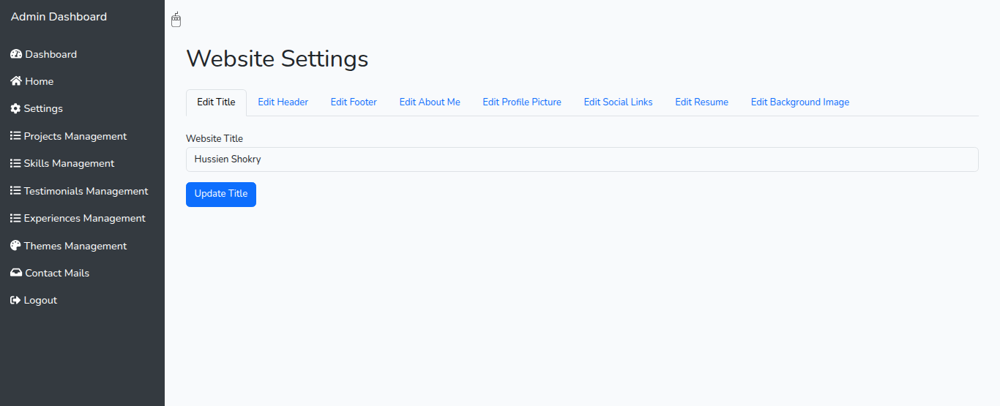

# Dynamic Portfolio

## Screenshots

### Landing Page

*The main portfolio landing page showcasing your professional profile*

### Admin Dashboard

*Central admin dashboard for managing all portfolio content*

### Projects Management

*Manage and organize your portfolio projects*


*Detailed project editing interface*

### Skills Section

*Showcase and manage your professional skills*

### Experience Timeline

*Manage your professional experience timeline*

### Testimonials

*Collect and display client testimonials*

### Theme Customization

*Customize your portfolio's appearance with different themes*

### Contact Management

*Manage incoming contact form submissions*

### Settings

*Configure your portfolio settings and preferences*

A powerful and flexible Laravel-based portfolio management system that allows you to create and manage your professional portfolio with ease. This system provides a dynamic way to showcase your work, skills, experiences, and achievements.

## Features

- **Portfolio Management**: Easily manage and showcase your projects
- **Theme Customization**: Customize the look and feel of your portfolio
- **Skills Section**: Highlight your technical and professional skills
- **Experience Timeline**: Display your work and educational experiences
- **Testimonials**: Share feedback and recommendations from clients/colleagues
- **Contact Form**: Allow visitors to get in touch with you
- **Admin Dashboard**: Secure admin interface to manage all content
- **Responsive Design**: Mobile-friendly and responsive across all devices

## System Requirements

- PHP >= 8.1
- Laravel 10.x
- MySQL/PostgreSQL
- Composer
- Web Server (Apache/Nginx)

## Installation

1. Clone the repository:
```bash
git clone https://github.com/yourusername/dynamic-portfolio.git
```

2. Install dependencies:
```bash
composer install
```

3. Configure environment:
```bash
cp .env.example .env
php artisan key:generate
```

4. Set up database:
```bash
php artisan migrate:fresh --seed
```

5. Start the server:
```bash
php artisan serve
```

## Usage

1. Access the admin dashboard at `/admin`
2. Log in with your credentials
3. Start managing your portfolio content through the intuitive interface
